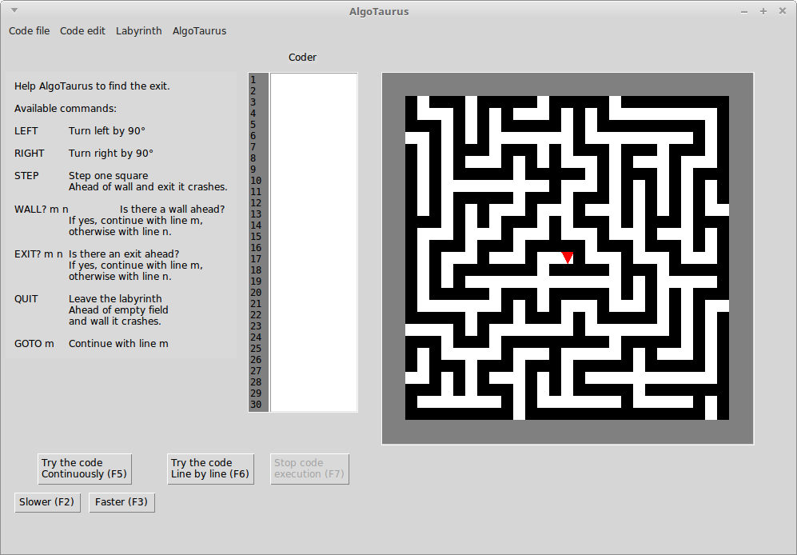

AlgoTaurus
==========
An educational game to teach programming.
Write a program to make the AlgoTaurus find the exit.

## Installation

On Windows
- Download the installer from the [Relase page](https://github.com/AlgoTaurus/algotaurus/releases) or from [SourceForge](http://sourceforge.net/projects/algotaurus/)
- After installation you can run AlgoTaurus from the Start menu.

On Linux
- Download the source files from the [Relase page](https://github.com/AlgoTaurus/algotaurus/releases) and unzip them.
- Open terminal in the directory you have copied the files to and type 'python algotaurus.py'
- (Or you can use the Windows version with Wine.)

## Usage

How to build the code?

- You can write the code in the Coder pane.
- You can only use the available commands (see the left of the window).
- The AlgoTaurus will proceed with the commands one after the other, unless a specific number line in the command says where to continue.
- For example, the simple program below will turn left infinitely (not an effective way to find the exit).
    - [1 ] LEFT
    - [2 ] GOTO 1
- When the Code is ready, you can try the code clicking on the Run button at the bottom of the window (processing the code continuously), 
or repeatedly clicking on the Step button (processing the code line by line)
- In the Run mode you can slow down or speed up processing clicking on the appropriate button at the bottom of the window.
- Every time you start Running the code a new labyrinth will be generated and the starting position of AlgoTaurus will be random. 

Some tasks to solve and discuss:

- Write the code to find the exit.
- What does the code do? Try to describe/explain it in a higher level language.
- How can you be sure that the code works correctly every time?
- Try to make the code as short as possible.
- Try to make the code to move as little as possible.
- Try to minimize the number of lines needed to be executed.

## Localization

If you want to use AlgoTaurus in other languages, you can help translating it on [POEditor](https://poeditor.com/projects/view?id=91267).

Localizers: Attila Krajcsi (Hungarian), Seyed Amir Hossein Yousefi (Persian)

## Changelog

Upcoming version
- Persian version (thanks to Seyed Amir Hossein Yousefi)
- AlgoTaurus can be installed as Python package

Version 1.1.1
- Add menu shortcuts
- Add Help to AlgoTaurus menu
- Bug fixes

Version 1.1
- Multiple labyrinth types
  - Simple 4-walls "labyrinth"
- User interface and commands are localizable
  - Hungarian version
- Usability refinements
- Bug fixes

Version 1.0
- Initial release

## Copyright

The game is a remake and an extension of the game Labirint by Lukyanov Konstantin and Volkov Sergey.

Copyright, 2015-2018, Attila Krajcsi, Ádám Markója (GUI)

AlgoTaurus is distributed under the terms of the GNU General Public License 3.
